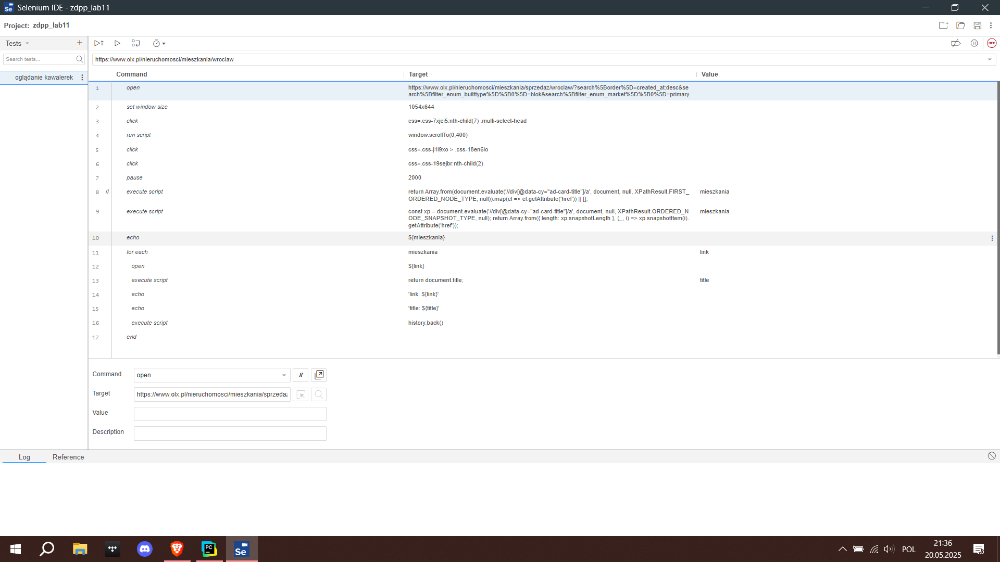

# Selenium

---

## Scraper
Stworzono program do scrapowania ofert mieszkań z portalu [olx.pl](https://www.olx.pl/nieruchomosci/mieszkania/sprzedaz/wroclaw/?search%5Border%5D=created_at:desc&search%5Bfilter_enum_builttype%5D%5B0%5D=blok&search%5Bfilter_enum_market%5D%5B0%5D=primary) z wykorzystaniem biblioteki selenium dostępnej w języku Python.

Pobiera on wszystkie oferty mieszkań w Wrocławiu, które są wystawione na sprzedaż. Z uwagi na dużą ilość danych naniesiono odpowiednie filtry zmniejszające ich ilość dla szybszego działania programu.
Oferty są porównywane z wynikami zapamiętanymi po przednim skanowaniu, pokazywane oferty nowe, usunięte oraz zmodyfikowane.

Przykład:
```text
Scanning offers...
page: 1
page: 2
page: 3
new offers: 4
{Title: 4 pokoje|Stadion|Park|Komunikacja miejska|, Price: 970 202 zł, Location: Wrocław, Date: 02 maja 2025, Ref: https://www.otodom.pl/pl/oferta/4-pokoje-stadion-park-komunikacja-miejska-ID4tjZK.html
, Title: Armii Krajowej 8A - mieszkanie 2 pokoje - 41,63 m2, Price: , Location: Brzeg, Date: 25 kwietnia 2025, Ref: https://www.otodom.pl/pl/oferta/armii-krajowej-8a-mieszkanie-2-pokoje-41-63-m2-ID4v7JA.html
, Title: Nowe mieszkanie ze słoneczną sypialnią w Inwestycji LEŚNA 7, Price: , Location: Strzelin, Date: 20 kwietnia 2025, Ref: https://www.olx.pl/d/oferta/nowe-mieszkanie-ze-sloneczna-sypialnia-w-inwestycji-lesna-7-CID3-ID12nA8x.html?reason=extended_search_extended_distance
, Title: Nowe bloki, Korczaka 15 B, parter, Price: , Location: Dzierżoniów, Date: 28 kwietnia 2025, Ref: https://www.otodom.pl/pl/oferta/nowe-bloki-korczaka-15-b-parter-ID4iqTu.html
}
-----------------
deleted offers: 0
set()
-----------------
updated offers: 1
{Title: 70 m²+OGRÓDEK +1miejsce parking.-KAMERALNE - C, Price: 580 000 zł, Location: Lutynia, Date: -1 kwietnia 2025, Ref: https://www.otodom.pl/pl/oferta/70-m-ogrodek-1miejsce-parking-kameralne-c-ID4h4pN.html
}
```

## Selenium IDE

---

Test otwiera określoną stronę na [olx.pl](https://www.olx.pl/nieruchomosci/mieszkania/sprzedaz/wroclaw/?search%5Border%5D=created_at:desc&search%5Bfilter_enum_builttype%5D%5B0%5D=blok&search%5Bfilter_enum_market%5D%5B0%5D=primary) i otwiera po kolei wszystkie oferty sprzedaży.
Test utworzono z wykorzystaniem z narzędzia Selenium IDE, które jest dostępne jako dodatek do przeglądarki Chrome.

